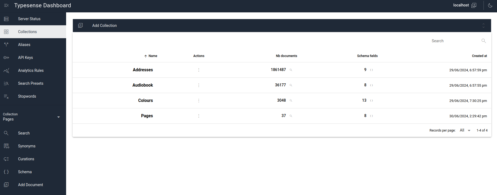

## Development Environment

The author uses docker-compose for development but this is not required.

```yml
version: "3"

services:
  webserver:
    image: php:8.3
    ...
  database:
    image: mysql:8
    ...
  typesense:
    image: typesense/typesense:26.0
    restart: on-failure
    ports:
      - "28108:8108"
    volumes:
      - ./typesense-data:/data
    command: '--data-dir /data --api-key=${TYPESENSE_API_KEY} --enable-cors'
    environment:
      TYPESENSE_API_KEY: ${TYPESENSE_API_KEY}
  typesense-dashboard:
    image: ghcr.io/bfritscher/typesense-dashboard:latest
    ports:
      - '${HOST_MACHINE_TYPESENSE_DASHBOARD_PORT}:80'

```

The two local Typesense images are not actually necessary: you can develop against an externally hosted Typesense installation if that suits your needs better.  

The dashboard application is available publicly at https://bfritscher.github.io/typesense-dashboard. It is an "offline" application in that it can be saved offline and run inside a private network without an external internet connection.  It can also be used to connect to any Typesense installation in the world, as long as that installation has CORS enabled and the domain has been whitelisted.


