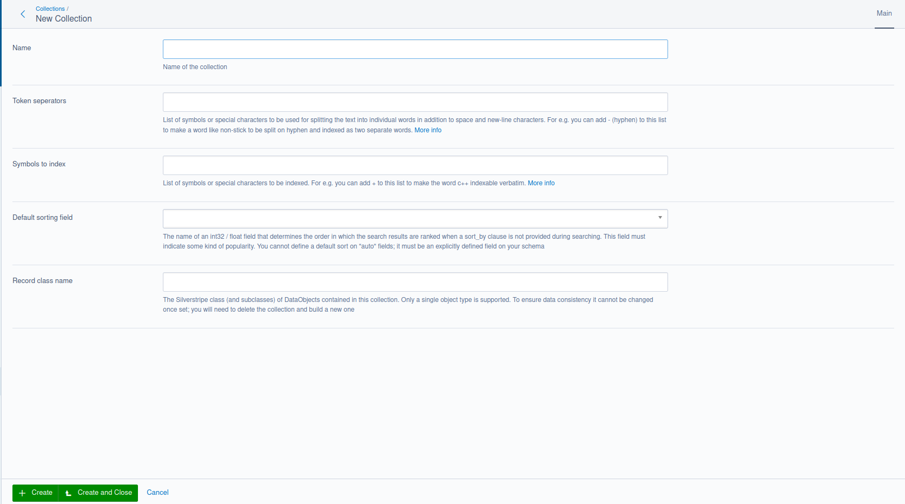
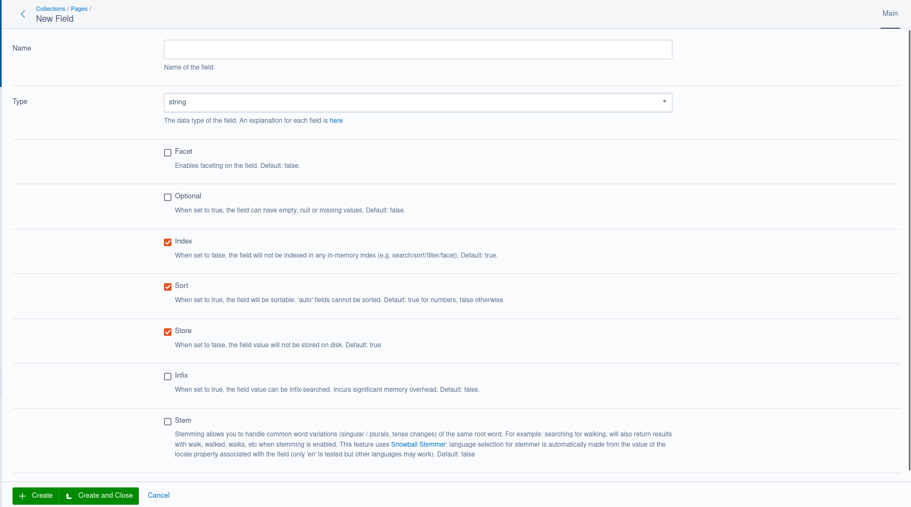
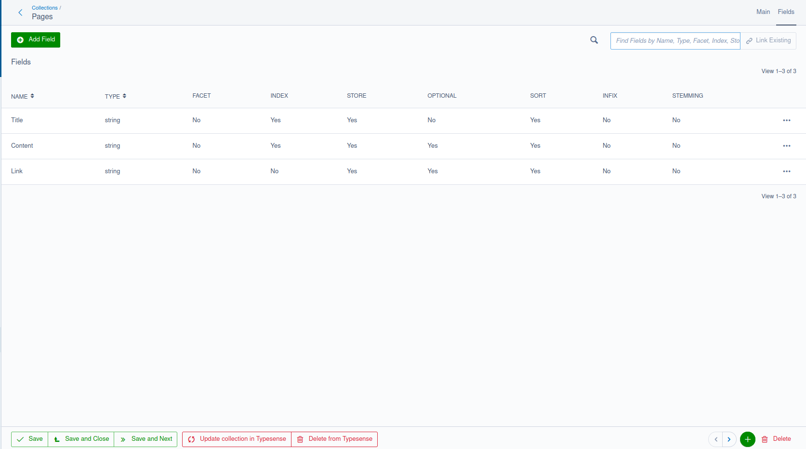

## Creating a collection

Collections are defined and initially created with YML:

```yml
ElliotSawyer\SilverstripeTypesense\Typesense:
  collections:
    Page:
      name: Pages
      fields:
        - { name: Title, type: string, sort: true }
        - { name: Content, type: string, optional: true }
        - { name: Link, type: string, index: false, optional: true}
      default_sorting_field: # 'exampleField'
      token_separators: # '-'
      symbols_to_index: # '+'
      import_limit: 10000
      connection_timeout: 2 
      excluded_classes:
        - SilverStripe\ErrorPage\ErrorPage
```

What's happening here:

* As you are defining the collection on the Page type, only these type of records are inserted into the collection. Subclasses of this page are also included
* By default, all subclasses of Page are included. To exclude any classes, define an array of them on excludedClasses
* The `fields` array of arrays defines your Typesense schema. [A list of field types is here](https://typesense.org../26.0/api/collections.html#field-types).  DBDate, DBTime, and DBDateTime fields are converted to integers.
* If a `default_sorting_field` key is defined, it must be an int or float type. It does not yet support sorting by strings and must be explicitly named - "auto" fields based on a regex are not accepted.

On dev/build, a collection schema will be generated so that it can be managed in the Typesense Admin in the CMS. The indexer will collate all records according to this schema and send it to Typesense.

By default, all collections use the Collection class when the `TypesenseSyncTask` is run using a very generic `import` method to send data to its collection. 

Run `dev/tasks/TypesenseSyncTask`.  All Page records will be inserted with the `import()` method with any excluded classes removed. To inspect your collection, documents, and test search, you can log into your local Typesense installation with https://bfritscher.github.io/typesense-dashboard using your admin API key (assuming CORS is enabled)

When the task `TypesenseSyncTask` is run, all collections defined in this YML will be built and synced with Typesense once all required fields and at least one Typesense Field is defined.  Once this is done, the next time you run the task collection building is skipped, and records will be bulk imported.

### Configuring your collection



The only fields that are required here are `name` and the `fields` array. `excludedClasses` is used when you want to exclude a particular subclass from being indexed (for example, error pages, redirectors, and other pages that may not have any searchable content).

These fields are also optional.  They affect how the collection indexes content and the order of the results.  More information of these fields can be found [here](https://typesense.org/docs/26.0/api/collections.html#schema-parameters).

#### default_sorting_field: 

This must be a `int32` or `float` field that exists inside your collection. To work properly it should denote some kind of popularity or score.

#### token_separators

List of symbols or special characters to be used for splitting the text into individual words in addition to space and new-line characters.

For example you can add - (hyphen) to this list to make a word like non-stick to be split on hyphen and indexed as two separate words.

#### symbols_to_index

List of symbols or special characters to be indexed.

For example you can add + to this list to make the word c++ indexable verbatim.

#### import_limit and connection_timeout

These used internally by the Silverstripe Typesense module to limit how many records can be imported into Typesense at once. You would only need to change these when considering performance or resourcing issues.  For example, you may have a large amount of RAM and processing power available, you might consider increasing the **import_limit** value to handle larger bulk uploads. However, local resources are not everything: the Typesense server may not be able handle a large number of documents responsively (for example if it is underload).  In this case, you might consider increasing the **connection_timeout** value

### Configuring your fields




Fields should correspond with individual fields on your DataObject, but a field can actually represent anything - such as a getter method or an array of results from a relationship - depending on the data type of the field.  You'll need to define a `getTypesenseDocument()` method on your object to provide that information

#### Field attributes 

Each field can have the following attributes.  Only `name` and `type` are required fields

* **name**: Name of the field.
* **type**: The data type of the field (see the section below for a list of types).
* **facet**: Enables faceting on the field. Default: false.
* **optional**: When set to true, the field can have empty, null or missing values. Default: false.
* **index**: When set to false, the field will not be indexed in any in-memory index (e.g. search/sort/filter/facet). Default: true.
* **store**: When set to false, the field value will not be stored on disk. Default: true.
* **sort**: When set to true, the field will be sortable. Default: true for numbers, false otherwise.
* **infix**: When set to true, the field value can be infix-searched. Incurs significant memory overhead. Default: false.

#### Field types

* **string**: String values
* **string[]**: Array of strings
* **int32**: Integer values up to 2,147,483,647
* **int32[]**: Array of int32
* **int64**: Integer values larger than 2,147,483,647
* **int64[]**: Array of int64
* **float**: Floating point / decimal numbers
* **float[]**: Array of floating point / decimal numbers
* **bool**: true or false
* **bool[]**: Array of booleans
* **geopoint**: Latitude and longitude specified as [lat, lng].
* **geopoint[]**: Arrays of Latitude and longitude specified as [[lat1, lng1], [lat2, lng2]].
* **object**: Nested objects.
* **object[]**: Arrays of nested objects.
* **string***: Special type that automatically converts values to a string or string[].
* **image**: Special type that is used to indicate a base64 encoded string of an image used for Image search.
* **auto**: Special type that automatically attempts to infer the data type based on the documents added to the collection.
#

### Managing your collections




Collections can also be created, managed, and deleted in the CMS. What's in the database is considered the "source of truth" that will be synced with Typesense.  Nothing stored on the Typesense server will overwrite the collection you have configured in the CMS.

Once the collection is created in the CMS and at least one field is added, you'll have two CMS actions available.  These are potentially destructive actions because they change the data present on the remote Typesense server.

#### Update collection in Typesense

This is used to update the collection when the schema has changed. This is achieved by replacing it entirely if it already exists. When this occurs, the collection will need to be reindexed with `TypesenseSyncTask`.  

Bulk imports are not possible until the collection has been uploaded to Typesense.

#### Delete from Typesense

This is used to delete the collection from Typesense.  When the local collection is deleted, this action is invoked to automatically remove it from Typesense.

