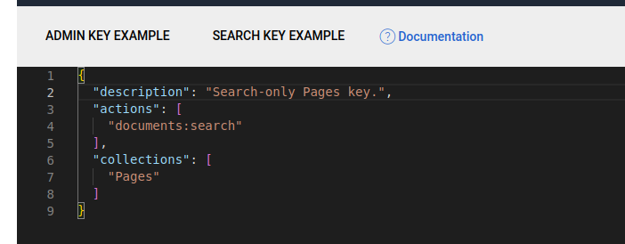

## Searching

To enable a basic traditional search (type a full query and execute once), create a controller and a route to it to respond to your search query (or use a page type with an action on it). For example:

Note that when you're searching in this way, you're making use of the project's global `Typesense::client()` and performs searches using the super-admin key.  While this is fine for backend use, you would not want to expose it to a front-end application.  You would want to use a search-only key for this: see "Instantsearch" section below.

```yml
SilverStripe\Control\Director:
  rules:
    'search': 'YourName\YourProject\SearchController'
```

```php
class SearchController extends Controller
{

    public function index($request)
    {
        $client = Typesense::client();

        $collectionName = 'Pages';

        if($collectionName) {
            $term = $request->getVar('term') ?? '*';
            $searchParameters = [
                'q' => $term,
                'query_by' => 'Title, Content',
            ];

            $search = $client->collections[$collectionName]->documents->search($searchParameters);

            var_dump($search);
        }

    }
}
```

### Creating a search only key

In practice, you never want to expose your admin-only key in front-end forms.  For public front-end searches you'll need to obtain a search-only key from the Typesense server.  While there are a number of ways to do this (including via the PHP SDK), the easiest is to use the Typesense dashboard: 

* http://localhost:18108/#/apikeys
* https://bfritscher.github.io/typesense-dashboard/#/apikeys


|  |   |
| -------- | ------- |

Select "Search Key Example" and change the description and "collections" array to `Pages` (or the name(s) of the collection(s) this key will be searching) and select "Create API Key" in the bottom right.  You'll be shown the API key _one time_ before it's never shown again - record this value and save it in the TYPESENSE_SEARCH_KEY environment variable.

You'll need to expose this key in a method somewhere, such as `Page::getTypesenseSearchKey()`:

```php
    public function getTypesenseSearchKey() {
        return Environment::getEnv('TYPESENSE_SEARCH_KEY');
    }
```

### Instantsearch

You can set up Typesense to use Algolia's Instantsearch library, using an adapter provided by Typesense. 

* https://github.com/typesense/typesense-instantsearch-adapter
* https://github.com/algolia/instantsearch/tree/v4.44.0

Please note this is a development-only example and may be outdated. In a production environment you would not want to load external Javascript in this way, and ensure you're working with a recent supported version.

Expose the search-only key in the HTML below:

```html
<script type="application/javascript" src="https://cdn.jsdelivr.net/npm/instantsearch.js@4.44.0"></script>
<script type="application/javascript" src="https://cdn.jsdelivr.net/npm/typesense-instantsearch-adapter@2/dist/typesense-instantsearch-adapter.min.js"></script>
<header>
<div id="global-search-input"></div>
</header>

<div id="global-search-container" class="container d-none" data-typesense-search-key="$TypesenseSearchKey">
    <div class="row">
        <div class="col-12">
            <h3>Results</h3>
        </div>
        <div class="col-3">
            <div id="global-refinementList-Tags"></div>
        </div>
        <div class="col-9">
            <div id="global-stats"></div>
            <div id="global-hits"></div>
        </div>
    </div>
</div>
```

```js
document.addEventListener("DOMContentLoaded", function(event) {
    let typesenseApiKey = document
        .getElementById('global-search-container')
        .getAttribute('data-typesense-search-key');

    const typesenseInstantsearchAdapter = new TypesenseInstantSearchAdapter({
        server: {
            apiKey: typesenseApiKey, // Be sure to use an API key that only allows searches, in production
            nodes: [
                {
                    host: 'your-external-ip-or-dns-name',
                    port: '8108',
                    protocol: 'http',
                },
            ],
        },
        additionalSearchParameters: {
            queryBy: 'Title,Content,Tags'
        },
    });
    const searchClient = typesenseInstantsearchAdapter.searchClient;

    const search = instantsearch({
        searchClient,
        indexName: 'Pages',
    });

    search.addWidgets([
        instantsearch.widgets.searchBox({
            container: '#global-search-input',
            showSubmit: false,
            showReset: false,
            placeholder: 'type in a search term... ',
            autofocus: true,
            cssClasses: {
                input: 'form-control me-2 w-100',
                loadingIcon: 'stroke-primary',
            },
        }),
        instantsearch.widgets.infiniteHits({
            container: '#global-hits',
            cssClasses: {
                list: 'list-unstyled',
                item: 'd-flex flex-column mb-5',
                loadMore: 'btn btn-secondary d-block mt-4',
                disabledLoadMore: 'btn btn-light mx-auto d-block mt-4',
            },
            templates: {
                item: (data) => {
                    return `
                    <article>
                        <h3><a href="${data.Link}" target="_blank">${data.Title}</a></h3>
                        <p>${data._snippetResult.Content.value}</p>
                    </article>
                        `;
                },
                empty: 'No results found for <q>{{ query }}</q>. Try another search term.',
                showMoreText: 'Show more results',
            },
        }),

        instantsearch.widgets.stats({
            container: '#global-stats',
            templates: {
                text: ({ nbHits, hasNoResults, hasOneResult, processingTimeMS }) => {
                    let statsText = '';
                    if (hasNoResults) {
                        statsText = 'no results';
                    } else if (hasOneResult) {
                        statsText = '1 result';
                    } else {
                        statsText = `${nbHits.toLocaleString()} results`;
                    }
                    return '';
                },
            },
            cssClasses: {
                text: 'text-muted',
            },
        }),

        instantsearch.widgets.refinementList({
            container: '#global-refinementList-Tags',
            attribute: 'Tags',
            searchable: true,
            searchablePlaceholder: 'Search tags',
            showMore: true,
            limit: 10,
            showMoreLimit: 100,
            operator: 'and',
            cssClasses: {
                searchableInput: 'form-control form-control-sm mb-2',
                searchableSubmit: 'd-none',
                searchableReset: 'd-none',
                showMore: 'btn btn-secondary btn-sm',
                list: 'list-unstyled',
                label: 'd-flex align-items-center mb-1',
                count: 'badge ml-2',
                checkbox: 'mr-2',
            },
        })
    ]);

    search.start();


    document.getElementById('global-search-input').addEventListener("keyup", (event) => {
        const searchContainer = document.getElementById('global-search-container'),
            layoutContainer = document.getElementById('layout-container'),
            inputContainer = searchContainer.querySelector("input");

        let inputLength = search.helper.state.query.length;

        if(inputLength > 0) {
            searchContainer.classList.remove('d-none');
            layoutContainer.classList.add('d-none');
        } else {
            searchContainer.classList.add('d-none');
            layoutContainer.classList.remove('d-none');
        }
    });

});

</script>
```

InstantSearch has many different configuration options that are beyond the scope of this documentation. A good open-source example application for how to achieve this can be found at https://findxkcd.com. [Source](https://github.com/typesense/showcase-xkcd-search)
