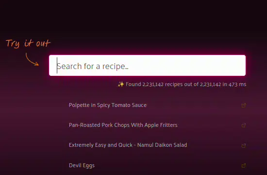

# Typesense Search for Silverstripe

**Author**: [Elliot Sawyer](https://sawyer.nz)

**Repository**: https://codeberg.org/0x/silverstripe-typesense

**Docs**: https://0x.codeberg.page/silverstripe-typesense/

**Live demos**: https://sawyer.nz/demos

|  |   |
| -------- | ------- |

Typesense is lightning-fast, open source search - no PhD required!  It is an open source alternative to Algolia and an easier-to-use alternative to ElasticSearch and Solr. It offers fast, typo-tolerant, in-memory fuzzy search for building delightful search experiences.

* https://typesense.org/
* https://github.com/typesense/typesense

This module was created to create a searchable Silverstripe website using Typesense for indexing.  It provides highly performant, nearly-instant, and often sub-millisecond response times. 

Typesense supports:

* Faceting
* Sorting
* Curated searches
* Synonyms
* Scoped, key-protected search
* Geospatial searches
* Machine learning and GPU-enhanced searches
* Automatic schema detection
* Analytics

## Documentation

* [Development](docs/en/development.md)
* [Installation](docs/en/installation.md)
* [Configuration](docs/en/configuration.md)
* [Managing Collections and Fields](docs/en/collections.md)
* [Syncing](docs/en/syncing.md)
* [How to search](docs/en/searching.md)
* [Troubleshooting](docs/en/troubleshooting.md)

## Copyright statements

This software includes contributions from Elliot Sawyer, available under the [LGPL3 With Attribution license](https://codeberg.org/0x/silverstripe-typesense/src/branch/main/LICENSE.md). This attribution statement is required to be shipped with the module, and is displayed within your application. These will appear in certain areas of your application where the module is being used.

## Support

Like my work? Consider shouting me a coffee or a small donation if this module helped you solve a problem. I accept cryptocurrency at the following addresses:

* Bitcoin: 12gSxkqVNr9QMLQMMJdWemBaRRNPghmS3p
* Bitcoin Cash: 1QETPtssFRM981TGjVg74uUX8kShcA44ni
* Litecoin: LbyhaTESx3uQvwwd9So4sGSpi4tTJLKBdz

Paid support is available.  Get in touch at https://sawyer.nz/contact
